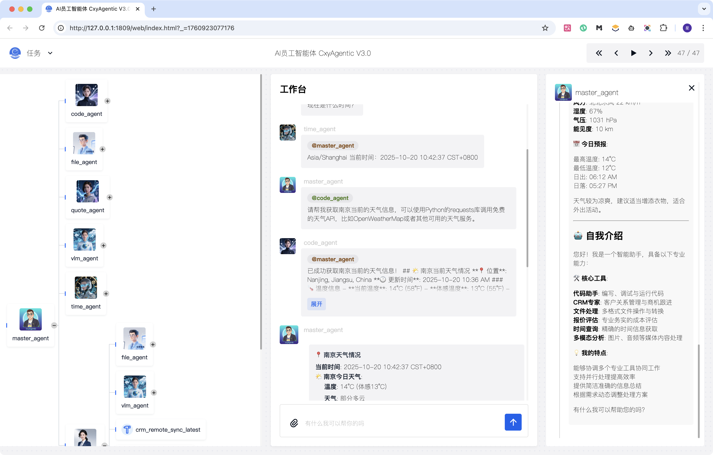
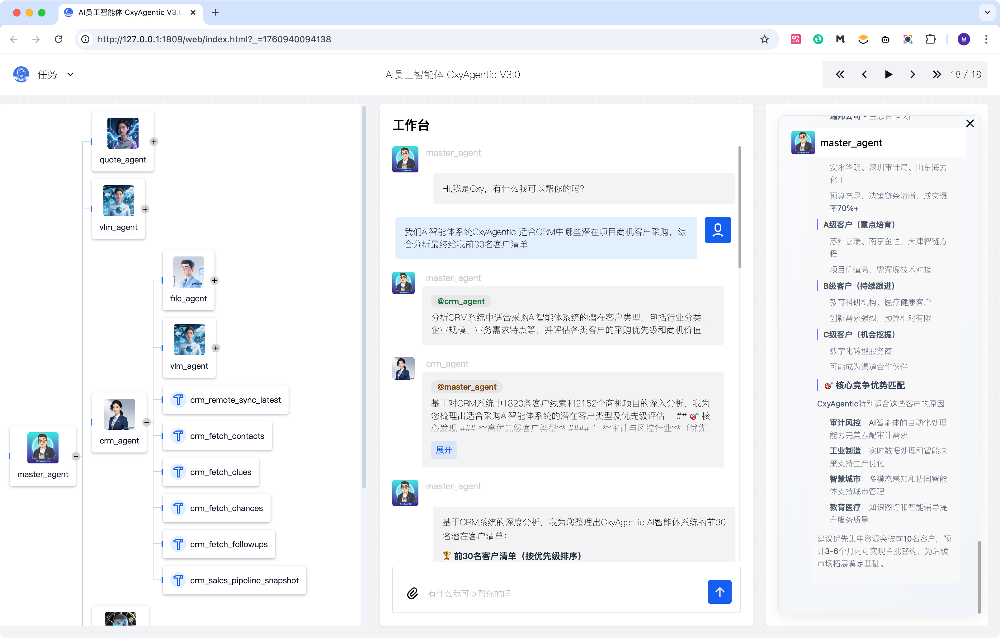

# CxyAgentic
## AI员工智能体 V3.0

<div align="center">

**构建可组合、可扩展的多智能体系统**

[产品官网](https://zunchuang.tech/cxy-agentic/index.html)

[](https://python.org)
[](https://github.com/enryteam/cxy-agentic)

将工具、模型、智能体统一为可插拔的原子算子——Cxy。像搭乐高一样构建灵活的多智能体系统，极致可扩展，每一步决策全链路可追溯。

</div>

## ✨ 核心特性

### 🏎️ **高效开发**
- **模块化设计**：标准化 Cxy 组件像乐高一样拼装，支持热插拔与跨场景复用
- **纯净接口**：简洁的 Python API，无需繁杂配置即可快速上手
- **热插拔架构**：运行时动态加载组件，无缝扩展系统功能

### 🤝 **智能协作**
- **动态规划**：智能体自动分解任务、协商解法、实时适应变化
- **全链路审计**：每一步决策完全可追溯，区别于刚性流程
- **自适应能力**：智能体自然应对突发挑战，保证系统鲁棒性

### 🕸️ **弹性架构**
- **任意拓扑**：支持从简单 ReAct 到复杂混合规划的智能体架构
- **自动依赖**：智能依赖映射与可视化调试
- **分布式优化**：轻松优化分布式系统性能

### 🔁 **持续进化**
- **学习机制**：每次交互都是学习机会，内置评估引擎自动生成训练数据
- **知识反馈**：智能体通过反馈持续自我进化
- **透明可追溯**：全过程透明可追踪，确保系统可控性

### 📈 **无限扩展**
- **线性扩容**：按 Metcalfe 定律支持分布式调度器
- **指数增长**：协作智能体数量呈指数级增长
- **全域优化**：轻松应对实时决策与大规模部署

## 🏗️ 框架架构


## 🖼️ 实景速览

> 还原多智能体协作的真实界面，从任务调度到业务洞察，呈现 CxyAgentic 的落地形态。

### 多智能体调度中心

- 流程树串联不同智能体，调用关系一目了然
- 聊天工作区完整保留上下文与执行结果
- 侧栏日志实时追踪智能体推理与响应详情

### 异构系统数据洞察

- 多源业务数据自动聚合，核心信息集中呈现
- AI 标注关键指标并计算处理优先级
- 生成阶段性行动建议并同步提醒团队

## 🎯 适用场景

### 👨‍💻 **开发者**
- 专注业务逻辑，无需重复造轮子
- 快速原型开发与迭代
- 灵活的工具集成能力

### 🏢 **企业用户**
- 一套框架打通所有智能体，告别信息孤岛
- 降低沟通成本，提升协作效率
- 可定制的智能体解决方案

### 🌟 **终端用户**
- 畅享智能体生态的无缝协作体验
- 直观的任务分解与执行流程
- 智能化的问题解决能力

### 🔧 **特色功能**
- **模块化 Skills 支持**：遵循 Claude Skills 规范，将 SOP、脚本、素材封装为标准目录
- **运行时热加载**：减少系统 Prompt 膨胀并加速交付（详见 `docs/skills.md`）

## 🚀 快速开始

### 环境准备

**创建虚拟环境（推荐）**

<details>
<summary>使用 Conda</summary>

```bash
conda create -n cxy_env python==3.10
conda activate cxy_env
```

</details>

<details>
<summary>使用 uv</summary>

```bash
curl -LsSf https://astral.sh/uv/install.sh | sh
uv python install 3.10
uv venv .venv --python 3.10
source .venv/bin/activate  # Windows: .venv\Scripts\activate
```

</details>

**安装依赖**

```bash
cd cxyagentic/
pip install -r requirements.txt

# macOS 用户可能需要
brew install coreutils
```

**Node.js 环境**（如果使用 MCP）

下载安装 [Node.js](https://nodejs.org)

### 配置示例

创建 `agentic.py`：

```python
import os
from cxyagentic import MAS, Config, cxy, preset_tools

# 配置默认 LLM
Config.set_agent_llm_model("default_llm")

# 定义智能体空间
cxy_space = [
    # LLM 配置
    cxy.HttpLLM(
        name="default_llm",
        api_key=os.getenv("DEFAULT_LLM_API_KEY"),
        base_url=os.getenv("DEFAULT_LLM_BASE_URL"),
        model_name=os.getenv("DEFAULT_LLM_MODEL_NAME"),
    ),

    # 时间智能体
    preset_tools.time_tools,
    cxy.ReActAgent(
        name="time_agent",
        desc="查询当前时间的智能体",
        tools=["time_tools"],
    ),

    # 文件操作智能体
    preset_tools.file_tools,
    cxy.ReActAgent(
        name="file_agent",
        desc="操作文件系统的智能体",
        tools=["file_tools"],
    ),

    # 主控智能体
    cxy.ReActAgent(
        is_master=True,
        name="master_agent",
        sub_agents=["time_agent", "file_agent", "math_agent"],
    ),
]

async def main():
    async with MAS(cxy_space=cxy_space) as mas:
        await mas.start_web_service(
            first_query="现在几点了？请将时间保存到 time.txt 文件中。"
        )

if __name__ == "__main__":
    import asyncio
    asyncio.run(main())
```

### 环境变量配置

<details>
<summary>方式一：终端设置</summary>

```bash
export DEFAULT_LLM_API_KEY="your_api_key"
export DEFAULT_LLM_BASE_URL="your_base_url"
export DEFAULT_LLM_MODEL_NAME="your_model_name"
```

</details>

<details>
<summary>方式二：.env 文件</summary>

创建 `.env` 文件：

```env
DEFAULT_LLM_API_KEY="your_api_key"
DEFAULT_LLM_BASE_URL="your_base_url"
DEFAULT_LLM_MODEL_NAME="your_model_name"
```

</details>

### 启动系统

```bash
python agentic.py
```

系统启动后，会自动运行初始查询并开启 Web 服务界面。

## 📖 文档

- [快速入门指南](docs/quickstart.md)
- [API 参考文档](docs/api.md)
- [架构设计](docs/architecture.md)
- [最佳实践](docs/best-practices.md)
- [常见问题](docs/faq.md)

## 🤝 贡献

我们欢迎社区贡献！请查看 [贡献指南](CONTRIBUTING.md) 了解如何参与项目开发。

## 📄 版权声明

**声明：本项目及分支所有源代码版权和解释权归尊创数字科技南京有限公司完全所有，侵权必究。**

---

<div align="center">

**⭐ 如果这个项目对你有帮助，请给我们一个 Star！**

</div>
